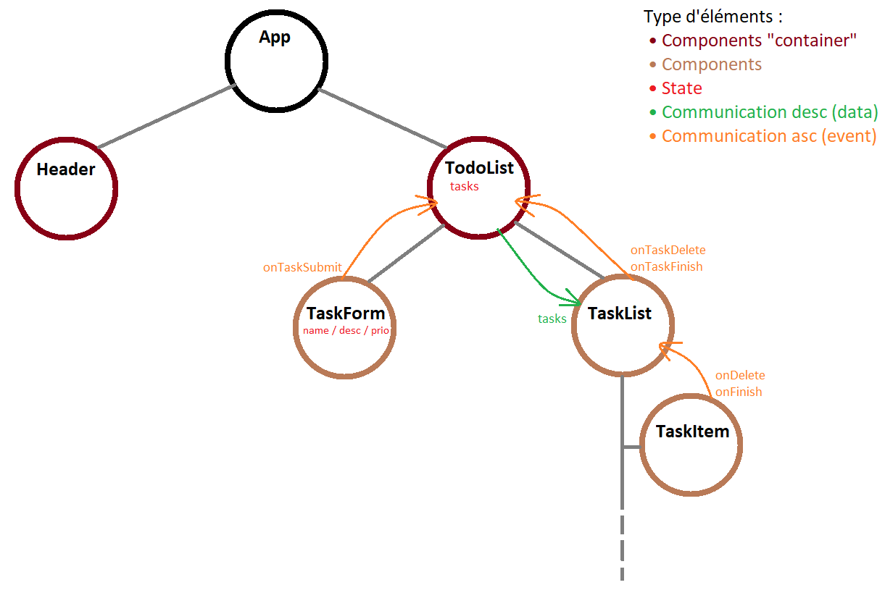

# Exo 04 - TodoList

## Structure des composants de l'app

## Méthodologie de travail
- Réaliser la structure de l'app _(Peut toujours évoluer)_
    - Définir les composants
    - Visualiser le flux de données (State + Communication)
- Coder...
    - Créer un composant _(Simple)_
    - Ajouter de la logique et/ou les interactions au composant
    - Passer à la fonctionnalité / composant suivant

### Ordre de dev durant la correction
- Composant Header
- Composant TodoList _(Simple)_
    - Structure de base
- Composant TaskForm
    - [Si basé sur un mockup] Adapter le code HTML en JSX
    - Ajouter le style _(SCSS)_
    - Gestion du formulaire _(Binding entre le form et le state)_
    - Interaction avec TodoList _(Props "Event" pour envoyer la tâche à l'élément parent)_
    - (Bonus) Gestion du focus
- Composant TodoList _(State)_
    - Traiter lees données envoyés par le formulaire
- Composant TaskList & TaskItem
    - [Si basé sur un mockup] Adapter le code HTML en JSX
    - Ajouter le style _(SCSS)_
    - Convertir les données "JS" vers du "JSX"
    - Interacction avec TodoList _(Deux props "Event" pour le delete et le finish)_
- Fonctionnalité de filtre des résultats
    - Analyse et mockup
    - Mise en place du JSX avec un State
    - Appliquer les règles de filtre avec la fonction "filter"